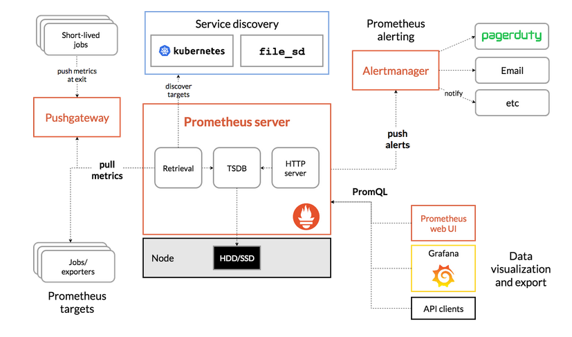

[TOC]

# 架构：



## 组件

Prometheus 由多个组件组成，但是其中许多组件是可选的：

- Prometheus Server：用于抓取指标、存储时间序列数据
- exporter：暴露指标让任务来抓
- pushgateway：push 的方式将指标数据推送到该网关
- alertmanager：处理报警的报警组件
- adhoc：用于数据查询

整体流程比较简单，Prometheus 直接接收或者通过中间的 Pushgateway 网关被动获取指标数据，在本地存储所有的获取的指标数据，并对这些数据进行一些规则整理，用来生成一些聚合数据或者报警信息，Grafana 或者其他工具用来可视化这些数据。

# 安装

Prometheus 是 Golang 编写的程序，所以要安装的话也非常简单，只需要将二进制文件下载下来直接执行即可，前往地址：<https://prometheus.io/download> 下载我们对应的版本即可。

Prometheus 是通过一个 YAML 配置文件来进行启动的，如果我们使用二进制的方式来启动的话，可以使用下面的命令：

```shell
$ ./prometheus --config.file=prometheus.yml
```

其中 prometheus.yml 文件的基本配置如下：

```yaml
global:
  scrape_interval:     15s
  evaluation_interval: 15s

rule_files:
  # - "first.rules"
  # - "second.rules"

scrape_configs:
  - job_name: prometheus
    static_configs:
      - targets: ['localhost:9090']
```

上面这个配置文件中包含了3个模块：global、rule_files 和 scrape_configs。

其中 global 模块控制 Prometheus Server 的全局配置：

- scrape_interval：表示 prometheus 抓取指标数据的频率，默认是15s，我们可以覆盖这个值
- evaluation_interval：用来控制评估规则的频率，prometheus 使用规则产生新的时间序列数据或者产生警报

rule_files 模块制定了规则所在的位置，prometheus 可以根据这个配置加载规则，用于生成新的时间序列数据或者报警信息，当前我们没有配置任何规则。

scrape_configs 用于控制 prometheus 监控哪些资源。由于 prometheus 通过 HTTP  的方式来暴露的它本身的监控数据，prometheus 也能够监控本身的健康情况。在默认的配置里有一个单独的  job，叫做prometheus，它采集 prometheus 服务本身的时间序列数据。这个 job 包含了一个单独的、静态配置的目标：监听  localhost 上的9090端口。prometheus 默认会通过目标的`/metrics`路径采集 metrics。所以，默认的 job 通过 URL：`http://localhost:9090/metrics`采集 metrics。收集到的时间序列包含 prometheus 服务本身的状态和性能。如果我们还有其他的资源需要监控的话，直接配置在该模块下面就可以了。


由于我们这里是要跑在 Kubernetes 系统中，所以我们直接用 Docker 镜像的方式运行即可。为了能够方便的管理配置文件，我们这里将 prometheus.yml 文件用 ConfigMap 的形式进行管理：（prometheus-cm.yaml）

```yaml
apiVersion: v1
kind: ConfigMap
metadata:
  name: prometheus-config
  namespace: kube-ops
data:
  prometheus.yml: |
    global:
      scrape_interval: 15s
      scrape_timeout: 15s
    scrape_configs:
    - job_name: 'prometheus'
      static_configs:
      - targets: ['localhost:9090']
```


配置文件创建完成了，以后如果我们有新的资源需要被监控，我们只需要将上面的 ConfigMap 对象更新即可。现在我们来创建 prometheus 的 Pod 资源：(prometheus-deploy.yaml)

```yaml
apiVersion: apps/v1
kind: Deployment
metadata:
  name: prometheus
  namespace: kube-ops
  labels:
    app: prometheus
spec:
  selector:
    matchLabels:
      app: prometheus
  template:
    metadata:
      labels:
        app: prometheus
    spec:
      nodeSelector:
        standAlone: "true"
      serviceAccountName: prometheus
      containers:
      - image: prom/prometheus:v2.4.3
        name: prometheus
        command:
        - "/bin/prometheus"
        args:
        - "--config.file=/etc/prometheus/prometheus.yml"
        - "--storage.tsdb.path=/prometheus"
        - "--storage.tsdb.retention=24h"
        - "--web.enable-admin-api"  # 控制对admin HTTP API的访问，其中包括删除时间序列等功能
        - "--web.enable-lifecycle"  # 支持热更新，直接执行localhost:9090/-/reload立即生效
        ports:
        - containerPort: 9090
          protocol: TCP
          name: http
        readinessProbe:
          failureThreshold: 10
          tcpSocket:
            port: 9090
          initialDelaySeconds: 60
          periodSeconds: 10
          successThreshold: 1
          timeoutSeconds: 30
        livenessProbe:
          failureThreshold: 3
          tcpSocket:
            port: 9090
          periodSeconds: 10
          successThreshold: 1
          timeoutSeconds: 1
        volumeMounts:
        - mountPath: "/prometheus"
          subPath: prometheus
          name: data
        - mountPath: "/etc/prometheus"
          name: config-volume
        - mountPath: "/etc/localtime"
          name: tz-config
        resources:
          requests:
            cpu: 100m
            memory: 512Mi
          limits:
            cpu: 100m
            memory: 2048Mi
      securityContext:
        runAsUser: 0
      volumes:
      - name: data
        persistentVolumeClaim:
          claimName: prometheus-data
      - configMap:
          name: prometheus-config
        name: config-volume
      - name: tz-config
        hostPath:
          path: /usr/share/zoneinfo/Asia/Shanghai
---

apiVersion: v1
kind: ServiceAccount
metadata:
  name: prometheus
  namespace: kube-ops
---
apiVersion: rbac.authorization.k8s.io/v1
kind: ClusterRole
metadata:
  name: prometheus
rules:
- apiGroups:
  - ""
  resources:
  - nodes
  - services
  - endpoints
  - pods
  - nodes/proxy
  verbs:
  - get
  - list
  - watch
- apiGroups:
  - ""
  resources:
  - configmaps
  - nodes/metrics
  verbs:
  - get
- nonResourceURLs:
  - /metrics
  verbs:
  - get
 
---
#由于我们要获取的资源信息，在每一个 namespace 下面都有可能存在，所以我们这里使用的是 ClusterRole 的资源对象，值得一提的是我们这里的权限规则声明中有一个nonResourceURLs的属性，是用来对非资源型 metrics 进行操作的权限声明，这个在以前我们很少遇到过，然后直接创建上面的资源对象即可：

---

apiVersion: rbac.authorization.k8s.io/v1beta1
kind: ClusterRoleBinding
metadata:
  name: prometheus
roleRef:
  apiGroup: rbac.authorization.k8s.io
  kind: ClusterRole
  name: prometheus
subjects:
- kind: ServiceAccount
  name: prometheus
  namespace: kube-ops

---
apiVersion: v1
kind: Service
metadata:
  name: prometheus
  namespace: kube-ops
  labels:
     app: prometheus
spec:
  selector:
    app: prometheus
  type: NodePort
  ports:
    - name: web
      port: 9090
      targetPort: http
      nodePort: 30100
---

apiVersion: extensions/v1beta1
kind: Ingress
metadata:
  name: prometheus
  namespace: kube-ops
  annotations:
    kubernetes.io/ingress.class: "nginx"
    nginx.org/client-max-body-size: "100m"
spec:
  rules:
    - host: prometheus.uprain.cn
      http:
        paths:
          - path: /
            backend:
              serviceName: prometheus
              servicePort: http
```

一个要注意的地方是我们这里必须要添加一个`securityContext`的属性，将其中的`runAsUser`设置为0，这是因为现在的 prometheus 运行过程中使用的用户是 nobody，否则会出现下面的`permission denied`之类的权限错误：`level=error ts=2018-10-22T14:34:58.632016274Z caller=main.go:617 err="opening storage failed: lock DB directory: open /data/lock: permission denied"`


# PromQL入门

最简单的 PromQL 就是直接输入指标名称，比如：

这条语句会查出 Prometheus 抓取的所有 target 当前运行情况，譬如下面这样：

```

# 表示 Prometheus 能否抓取 target 的指标，用于 target 的健康检查
up
```


也可以指定label来查询：

```
up{job="prometheus"}
```

这种写法被称为：**instant vector selectors**，这里不仅可以使用`=`号，还可以使用`!=`、`=~`、`!~`，比如下面这样(正则表达式https://github.com/google/re2/wiki/Syntax)：

```
up{job!="prometheus"}
up{job=~"kubernetes-kubelet|kubernetes-nodes"}
```

和 Instant vector selectors 相应的，还有一种选择器，叫做 **Range vector selectors**，它可以查出一段时间内的所有数据：

```
promhttp_metric_handler_requests_total{code="200",job="prometheus"}[1m]
```

这条语句查出 5 分钟内所有抓取的 HTTP 请求数，注意它返回的数据类型是 `Range vector`，没办法在 Graph 上显示成曲线图，一般情况下，会用在 Counter 类型的指标上，并和 `rate()` 或 `irate()` 函数一起使用（注意 rate 和 irate 的区别）,更多相关语法https://prometheus.io/docs/prometheus/latest/querying/functions/。

```
# 计算的是每秒的平均值，适用于变化很慢的 counter
# per-second average rate of increase, for slow-moving counters
rate(promhttp_metric_handler_requests_total{code="200",job="prometheus"}[5m])

# 计算的是每秒瞬时增加速率，适用于变化很快的 counter
# per-second instant rate of increase, for volatile and fast-moving counters
irate(promhttp_metric_handler_requests_total{code="200",job="prometheus"}[5m])
```


grafana dashboards:

```
8919
```

参考地址：

https://prometheus.io/docs/introduction/overview/

https://www.qikqiak.com/k8s-book/